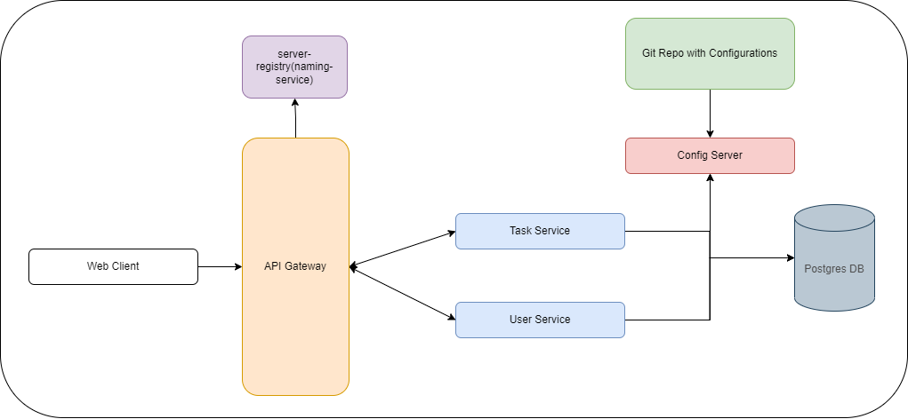

# Distributed Systems Microservice Architecture

This project is based on a distributed systems microservice architecture composed of five services. Each service serves a specific purpose and contributes to the overall functionality of the application. The following is an overview of each service:

# Overview

 

## 1. Naming Service

The **Naming Service** acts as a service registry to keep track of the available instances of each microservice in the application. It provides a centralized location for services to register themselves and enables other services to discover and communicate with them. This service plays a crucial role in facilitating communication and coordination among the microservices.

## 2. API Gateway

The **API Gateway** serves as a reverse proxy, accepting API calls from the client application and forwarding the traffic to the appropriate microservice. It acts as a single entry point for the client application and handles routing requests to the relevant services based on the requested endpoints. The API Gateway utilizes the **Naming Service** to locate the appropriate services, ensuring seamless communication between the client application and the microservices.

## 3. Config Server

The **Config Server** provides server and client-side support for externalized configuration in a distributed system. It acts as a central place to manage external properties for applications across all environments. The **Config Server** allows for dynamic configuration updates without the need to redeploy services, improving flexibility and ease of maintenance.

## 4. Auth Service

The **Auth Service** is responsible for authentication and authorization functionalities within the application. It handles user authentication, ensuring secure access to the system, and performs authorization checks to enforce access control policies. Additionally, the **Auth Service** provides CRUD operations for managing user data, including user registration, and user deletion.

## 5. Tasks Service

The **Tasks Service** is a simple REST service that performs CRUD operations on user tasks. It manages tasks' data, including attributes such as name, description, user ID, creation timestamp, update timestamp, and completion status. This service allows users to create, read, update, and delete tasks, providing essential functionality for task management within the application.

## Requirements

To set up and run the distributed systems microservice architecture, you will need the following tools:

- Maven: A build tool used for dependency management and building the project.
- Spring Boot 3.0+ (or higher): A framework that simplifies the development of microservices and provides essential features for building robust applications.
- Java 20: The Java programming language version 20 or higher.
- Postgres Server: A relational database management system used for persistent data storage.

## Microservice Running Process

To run the microservices and leverage the distributed systems architecture, follow these steps:

1. Start the **Naming Service** (Eureka Service) to enable service discovery and registration.
2. Launch the **Config Server** to manage external properties and configuration.
3. Start the **API Gateway** to serve as the entry point for the client application, handling request routing.
4. Start all other microservices, such as the **Tasks Service** and **Auth Service**, to provide specific functionalities.

Make sure to start the services in the specified order, as each service relies on the proper functioning of the preceding ones.
